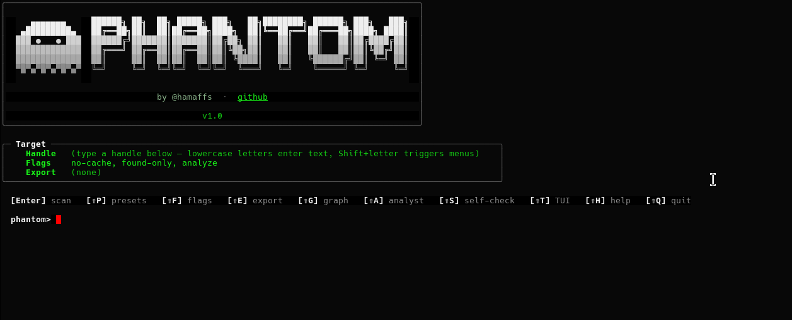
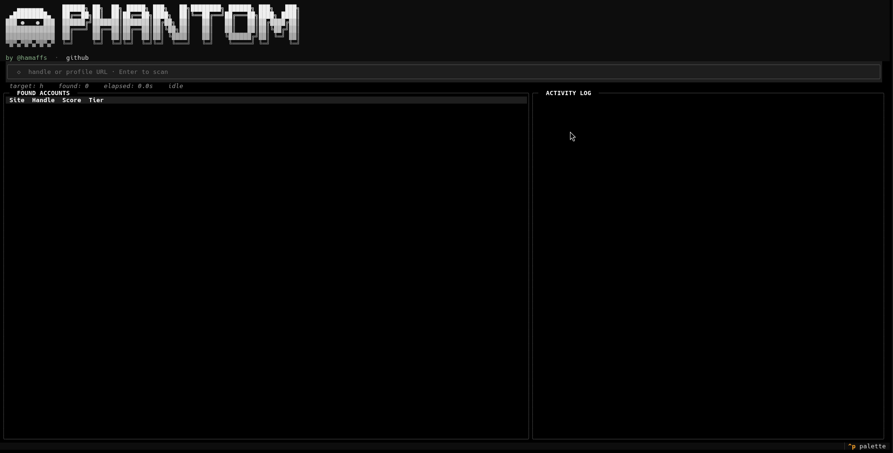
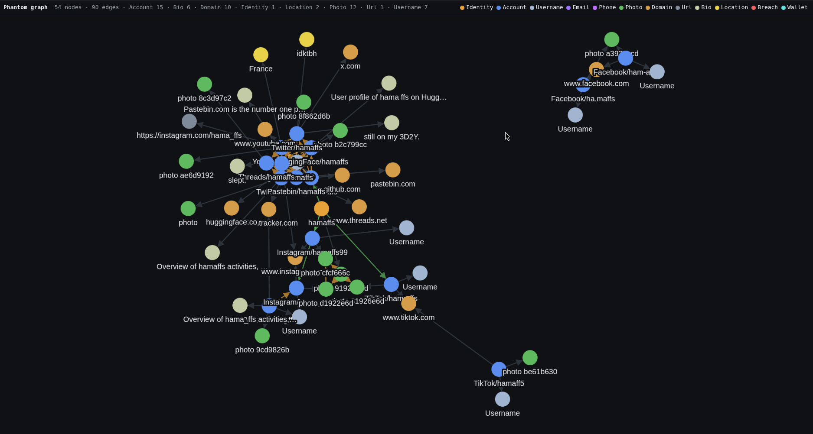

# Phantom

OSINT username checker for finding someone across the internet.

You give it a handle (or a name, or a profile URL), it checks ~99 sites in parallel and builds you a dossier: every account found, photos, cross-links, breach data, and an investigation graph you can click around.


## What it does

- **Username, name, or URL input.** `phantom username`, `phantom Firstname-Lastname`, `phantom https://github.com/****` — all work.
- **30 plausible variants by default** (separators, leetspeak, prefixes/suffixes, first/last name permutations). `--exact` if you want just the literal handle.
- **Per-account scoring** with a why-this-score trace — verified badge, photo matches another account, follower-count consistency, exact handle match. Nothing's a black box.
- **Identity clusters.** Photo hashing + cross-links + name matching group accounts into "this is the same person."
- **Bot-wall awareness.** Instagram / TikTok / Facebook get special handling so detection actually works.
- **HTML report** with an interactive identity graph, mentioned URLs, breach exposure (free APIs), and an optional LLM dossier.
- **Cases** — `phantom case new "case_name" && phantom case add "case_name" handle1 && phantom case add "case_name" handle2` accumulates findings into one persistent investigation file.


## Install

```bash
git clone https://github.com/hamaffs/Phantom-.git phantom
cd phantom
python3 -m venv .venv
.venv/bin/pip install -r requirements.txt
.venv/bin/playwright install chromium

# Make 'phantom' available anywhere
sudo ln -s "$PWD/phantom" /usr/local/bin/phantom
```

Optional:
- `apt install tesseract-ocr && pip install pytesseract` — enables OCR on profile photos
- `phantom --api add llm_api_key sk-ant-...` — enables `--analyze` (Anthropic or Groq)

## Use it

```bash
# Just scan a handle
phantom "username"

# Fast: skip variants and enrichment (~15s)
phantom "username" --exact

# Save the report
phantom "username" --export report.html

# Save multiple formats at once
phantom "username" --export r.html --export r.json --export r.pdf

# Search by name (auto-detects when input has whitespace)
phantom "Firstname-Lastname"

# Extract handle from a profile URL
phantom --parse https://twitter.com/"***"

# Add LLM analyst (dossier + contradictions + suggested pivots)
phantom "username" --analyze
```

### Interactive launcher

Just run `phantom` with no arguments — you get a launcher with presets, format pickers, and live status:




### Cases

For multi-target investigations:

```bash
phantom case new "case_name"
phantom case add "case_name" "username" --exact      # fast variant
phantom case add "case_name" "Firstname-Lastname"    # name-mode in same case
phantom case show "case_name"                     # graph summary
phantom analyze "case_name"                       # re-run LLM on saved case, no re-scan
```

## Output

After a scan, the terminal shows:

```
[ PRIMARY IDENTITY ] — hamaffs
  10 accounts · region: "" · max confidence: 80
  Sites: Facebook, GitHub, Instagram, Pastebin, Threads, TikTok, Twitter, YouTube
  ▸ github.com/hamaffs               (score 75)   [hamaffs]
  ▸ www.youtube.com/@hamaffs/about   (score 70)   [hamaffs]
  ▸ instagram.com/hamaffs            (score 80)   [hamaffs]
  ▸ instagram.com/hama_ffs            (score 65)   [hama_ffs]
  … and 6 more — see --export for full report

2902 checks across 30 variants in 68s
```

The HTML export has more: confidence breakdown per account, cross-platform photo matches, the identity graph, breach exposure from HudsonRock + ProxyNova + XposedOrNot, and the LLM dossier if you ran with `--analyze`.



## What's under the hood

- Two HTTP backends: `aiohttp` (fast, default) and `curl_cffi` with Chrome TLS impersonation (for sites that fingerprint clients). Playwright for the few sites that need a real browser.
- Per-host concurrency limits — tight ones for Instagram/TikTok/Facebook/Threads/X so they don't rate-limit us into UNKNOWNs.
- One-hour response cache so repeated scans are near-instant. Schema-versioned, so when sites change and I update detection rules, your cache auto-invalidates.
- Free breach lookups via HudsonRock (infostealer logs), ProxyNova (leaked credentials), XposedOrNot (public breaches). No paid HIBP needed.
- Photo correlation via perceptual hashing (phash + dhash + whash). Same avatar across platforms → same person.

## Limitations (honest ones)

- **Instagram bio, follower list, posts**: not accessible without a logged-in session. Phantom gets what's in the public meta tags (display name, photo, follower/post counts) and nothing more.
- **Reddit**: their API rate-limits unauthed clients aggressively. Sometimes works, sometimes 403s. Re-run if needed.
- **Facebook profiles without a vanity URL**: Phantom searches `facebook.com/public/Firstname-Lastname` in name-mode to find these. Without the public search, vanity-less accounts are invisible.
- **Sites behind WAF + IP reputation**: residential proxy fixes most cases. Out of scope by default.
- **Name search**: works, but only finds people whose handle includes their name. Most real people use unrelated handles — for those, search them on Google first, then feed the handle to Phantom.

## Self-check

When sites change their HTML, detection breaks silently. Run this periodically to find broken sites:

```bash
phantom --self-check
```

It probes a known-existing handle on every site and tells you which ones drifted.

## License

MIT. Do what you want.

## Credits

Authored by me 

Dm me if you find bugs.
